Like this? [Read my blog.](http://joshondesign.com/)

Found a problem? [File a bug on github.](https://github.com/joshmarinacci/simpleguide)

# Getting Started with the Printrbot Simple
### by josh marinacci


Gentle reader: Congratulations on the purchase or gift of your new Printrbot
Simple. I’ve really enjoyed mine and I think you will have a lot fun with yours
too. If you don't have one yet, I encourage you to [get one at
Printrbot.com][printrbotcom]. I've found it to be a completely fun and engaging
learning experience. I don't work for them; I'm just an avid fan.

[printrbotcom]:http://printrbot.com/

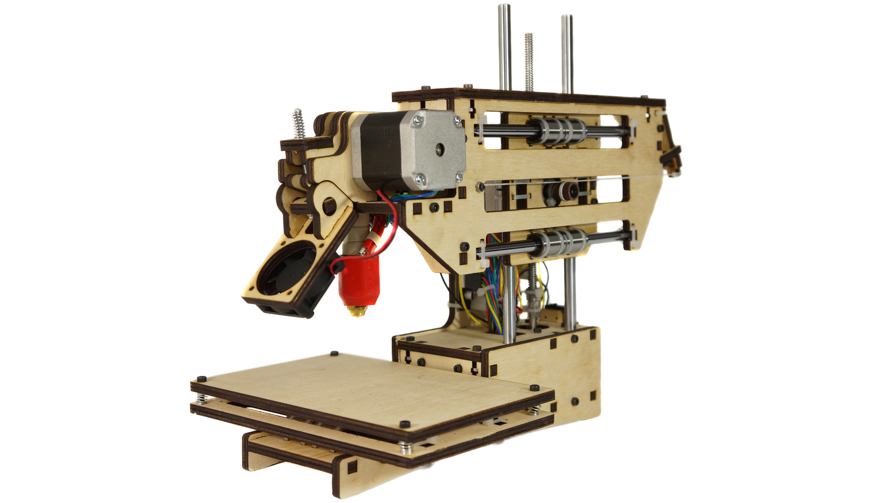

My goal with this guide is not to make you an expert in 3D printing. My goal is
simply to get you from assembly to your first decent print. Your prints won’t be
perfect. You will still want to calibrate and tweak. You'll still have more
challenging models to print; but hopefully you will be ready to experiment and
start *learning* instead of just being frustrated.

**NOTE**
<div class='note'>
I did not write this guide from scratch. I'm indebted to the community on
the PrintrBotTalk forums for helping me get started.  In particular
<a href='http://www.printrbottalk.com/forum/viewtopic.php?f=105&t=4454&sid=073d9faec7a3463068ba58c4fc173ce2'>The Complete Guide</a> by *bradleyc* helped me work through
many important details.


</div>


## Differences between Simple V1 and V2


First things first: Confusion between version 1 and version 2 of the Printrbot
Simple was a big source of problems for me when I started. There were significant
changes between V1 and V2, and much of the advice you find in the forums is
written with the V1 kit in mind. 

This guide covers version 2 of the Printrbot Simple. Any kit bought in the last
couple of months should be V2. If your kit came with a fan and end stops
included then you have a V2. If you have a V1 then I suggest you look at the
[official assembly guide][v1guide] from Printrbot.

[v1guide]: http://help.printrbot.com/Guide/How+to+Printrbot+Simple/52

## Mechanical Setup

The [assembly guide] [v2guide] on printrbot.com for the V2 is actually pretty
good. They have nice pictures and detailed instructions. Don’t be worried if you
feel like the assembly is slow. It took me about 6 hours to finish it, including
a few errors. Just take it slow and ask on the [forum][simpleforum] if you need
help. Really look at the pictures. They help a lot.

[v2guide]: http://help.printrbot.com/Guide/Printrbot+Simple+with+Large+Motors/59
[simpleforum]: http://www.printrbottalk.com/forum/viewforum.php?f=102

Before you go build it, a few words of advice. Here's a picture of the tools I used.

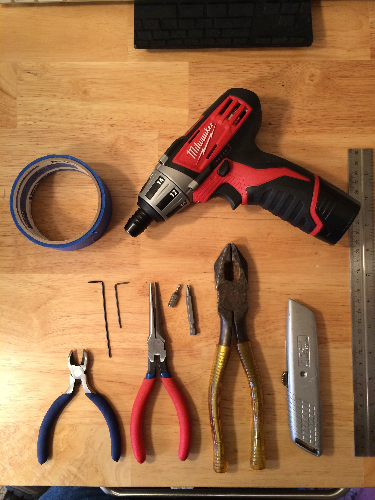

You *really* need some narrow needle nose pliers for inserting nuts into the
laser cut holes. You also need 2.5mm, 1.5mm, and 1/16" Allen wrenchs or driver
with hex bits. I highly suggest getting hex bits for your cordless drill. The
drill will make assembly *much* faster, especially towards the end when you are
sticking lots of wooden parts together. You also need a ruler with a metric
side. Oh, and some paper towels or a rag. Your hands will get dirty from the
laser cut wood and oil on the screws.


A few tips for assembly: 

On step 52, leave extra slack in the stepper cable. The photo shows it being
tight with only the fan cable loose. Instead, rotate the stepper 90 degrees so
the cable comes out of the side rather than of the bottom. This extra slack will let
you quickly remove the stepper motor later when you need to make extruder fixes.

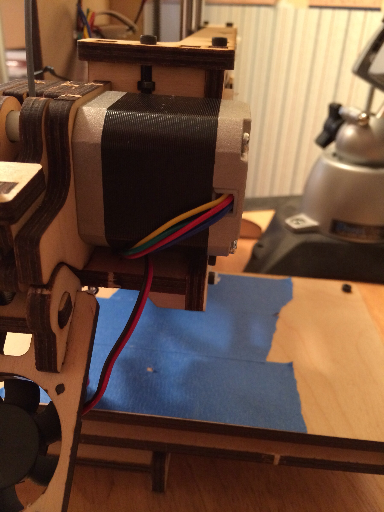

Now, go [build your bot!][v2guide], then come back here.


Number one link:
http://help.printrbot.com/

## Glossary

Now that your printer is assembled let’s go over some important terms.

Everything on the printrbot is in *metric*, usually millimeters (mm). Looking from
the front left-right is the **x axis**, in/out is the **y axis**, and up/down is the
**z-axis**. 

Your usable area is a **100mm** cube, or about four inches. Printing happens
on the **print bed**, which in our case is plywood. More advance printers have beds made
of metal, glass, or other materials; often heated. These are upgrades you can
apply later but don’t matter right now because we are printing PLA.


**Filament**: the spool of plastic you feed into the printer is called filament.
A mechanism at the top of your printer called the **extruder** pulls filament into
a tube called the **hot end**. As the name suggests, the hot end gets very hot to
melt the plastic, then squirts it onto your print bed. The temperature of the
hot end varies based on the plastic you are using. 

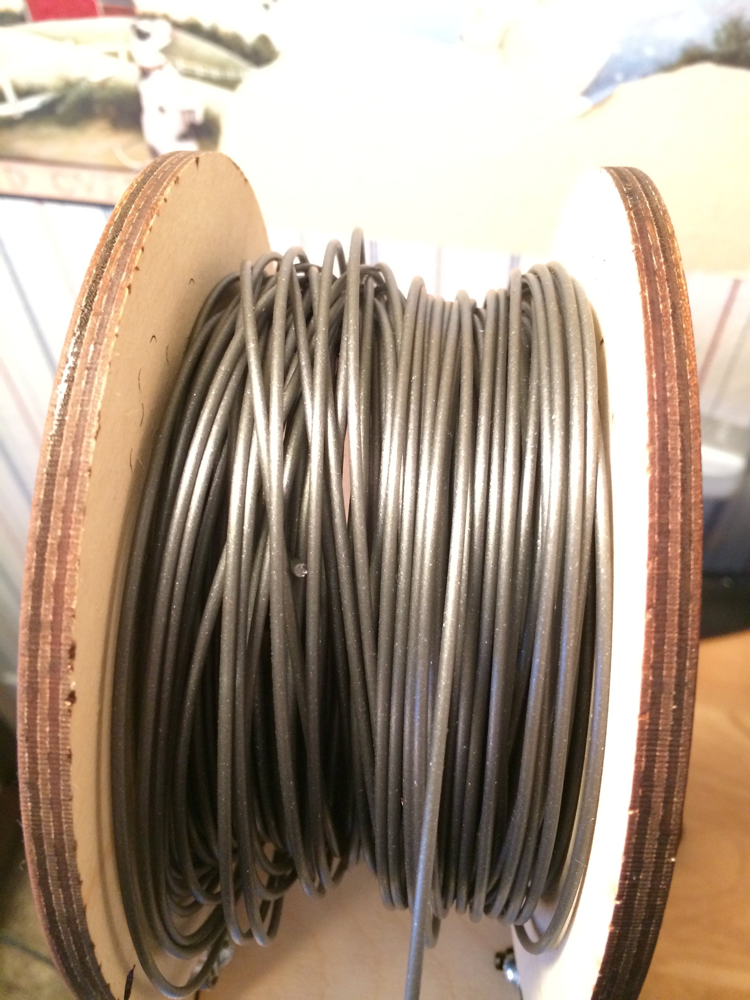

Your kit came with a kind of plastic called **PLA**. This is a bio-plastic that
melts at fairly low temperatures and does not require a heated bed. This makes
it easy to work with. The other common kind of plastic you will see is **ABS**,
which is used to make Lego among other things. ABS melts at a higher temp and
requires a heated bed to cool properly. We won’t be working with ABS in this
guide. Consider it an exercise for the advance reader.

When you assembled your printer you attached three contact switches which look like
this. They are called the **end stops**. The printer software uses these to tell
where the end of your bed is. This makes calibration a *lot* easier. 

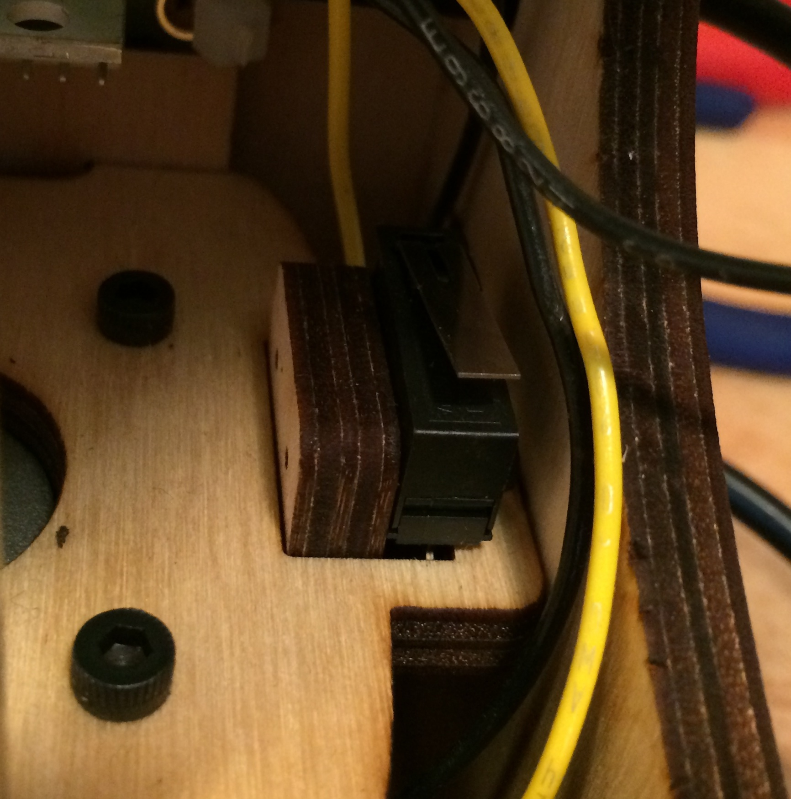

Your printer may not have the extra board on the right edge of this photo. My
printer has the Simple Tower upgrade which adds extra enclosing boards.


## Connecting to your computer

While the Printrbot Simple can run without a computer by using an SD card, to
get started we will only use it attached to a computer. Plug the power into your
printer and the wall, then attach the USB cable between the printer and your
computer. If you have Mac or Linux then you won’t need any special device
drivers. If you have Windows then you may need to install a special driver.
Please see the instructions in Section 4 of the [Printrbot Getting Started
Guide][printrbotpdf] (pdf)

[printrbotpdf]: http://printrbot.com/wp-content/uploads/2013/10/Getting-Started-Guide-Simple-10.11.13.pdf


Now download the [Repetier][repetier] software from here. This is the open
source software that processes 3D models and sends them to your printer.

[repetier]: http://www.repetier.com/


### Start Repetier
Start Repetier and open the *printer settings*. I’m going to show Mac
screenshots but Windows and Linux should look roughly the same.

This is the main screen of Repetier. Click on the *Printer settings* button in the
toolbar.

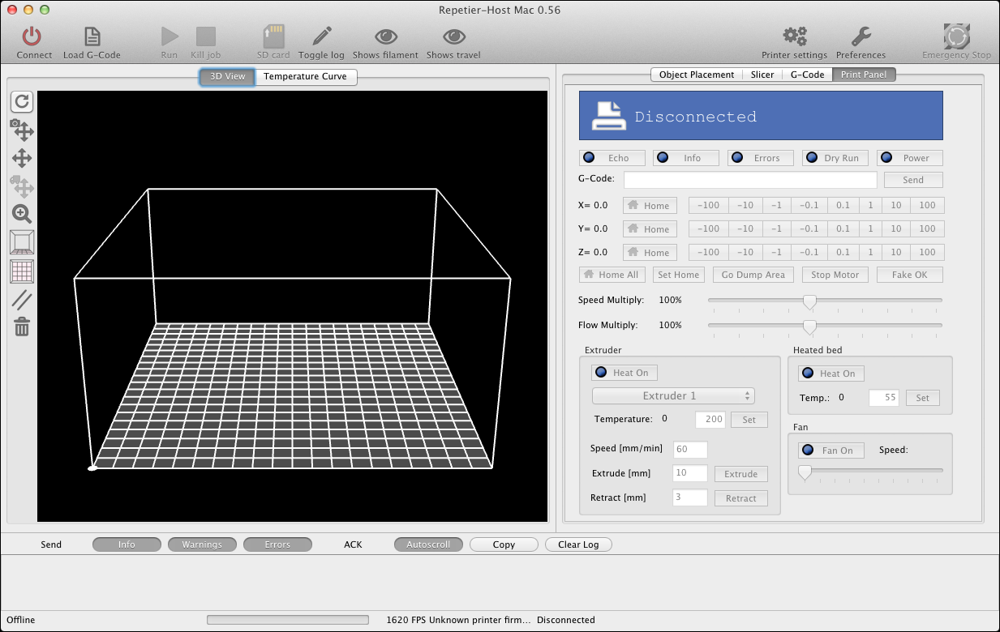


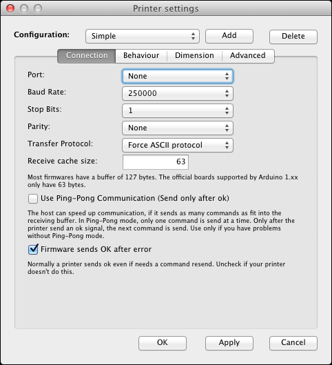

### Create a new printer
Click the ‘add’ button to create a new printer. name it *Simple*.

### Connection

In the connection tab, change the port to the printer. It should be something like:

```
usbmodem12345
Baud: 250000
stop bits: 1
parity; none
transfer protocol: Force ASCII protocol
```

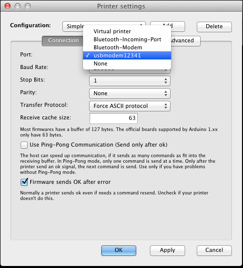


Now you can set up the other tabs.

### Behavior 

You can mostly leave these settings untouched. Change *Z Axis Travel Feedrate* to *240* and
the *Dump area position X* to *0*.

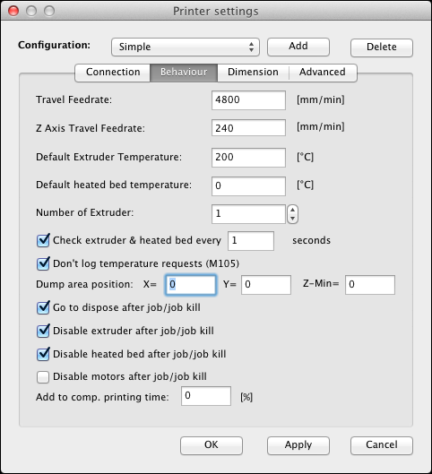

### Dimension

Set the *X Max*, *Y Max*, and *Print Area Width / Depth / Height* to *100*.

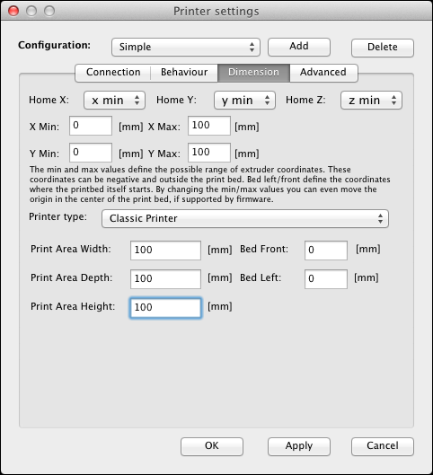

Don’t change anything on the ‘advanced’ tab. Now click *Apply* then *OK*. 

## Homing

You should be able to connect to your Simple over USB now. Press the connect button in the upper left toolbar, then
select the *Print Panel* tab (right side of the screen), and press the *1* button on the X axis. This will move the X
axis by one millimeter. If you get a connection error or checksum errors then scroll down to the trouble shooting
section of this guide. You might have to reflash your printer. Don’t worry: it’s a pretty fast process.

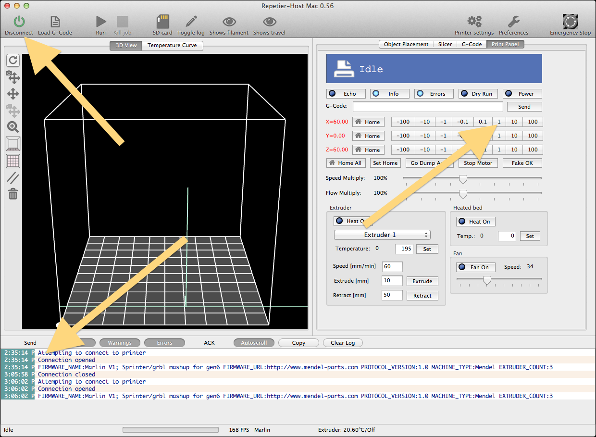

If moving the X axis worked then try moving the Y and Z axis. You have full manual control over them. Now, one at a
time, press the *Home* buttons for the X, Y. Don’t do the Z axis yet. Homing will make the printer go as far as it can in
that axis until it hits the end stop. While you are at it, make sure the strings for the Y and X axes are tight. If not
then tighten them up with the adjustment screws.

Before you do the Z axis: a word of advice. The assembly instructions don’t mention how far to turn the screw for the Z
end stop. If you press home before adjusting this the hot end will slam into your bed. Instead slowly lower the hot end
until it is almost touching the bed. Then turn the screw above the z end stop until it pushes the end stop down enough
to click. Now try pressing the Z axis home button. It should go down to engage the end stop and finish with the hot end
just touching the bed. Adjust the screw and press home again until there is just enough space to slip a sheet of
paper between the bed and the hot end. Now your Z axis is set up.

## Calibrating the Extruder

Repetier doesn’t know how much it must turn the stepper motor to pull through a certain amount of filament. It uses a 
default number called the E value. We will do some measurements to calculate the proper E-value for your printer.

First, turn on the hot end and heat it up to 190 C. You can see the temperature go up with the graph [picture] or the
value in the status bar. When it reaches over 175 C you can start extruding. Don’t put any filament in the printer yet.
Just press the *extrude* button set to 10mm. 

Did the stepper in the extruder move? Did it turn clockwise so that it would pull filament in? Did the hobbed gear move
along with the stepper? If the stepper didn’t move then you may have wiring issues. If the stepper moved but the gear
didn’t then you probably need to tighten up the set screw attaching the gear to the stepper. Head down to trouble
shooting for how to remove and adjust the stepper.

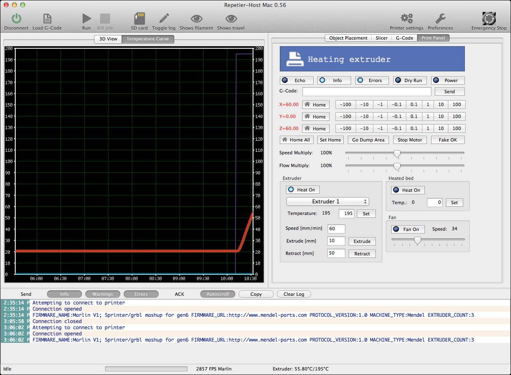

Assuming the extruder is working, press the extrude button for 10mm and feed the filament into your printer from the top
while it runs. Extrude 10mm at a time until you see molten filament come out the bottom of the hot end. If it never
comes out and the stepper starts clicking then you either have a clog in the hot end or the hobbed gear is loose and
skipping for some reason.

Once you can get filament come out, you can calibrate the extruder. With a ruler
measure 50 mm up from the top of the extruder and mark on the filament with a
marker or piece of tape. Now set extrusion to 10mm and extrude, then measure
again. If the height is now at 40mm then your printer is already calibrated. If
you just built your printer then this won’t be the case. Mine went 55mm when I
asked for 10mm.

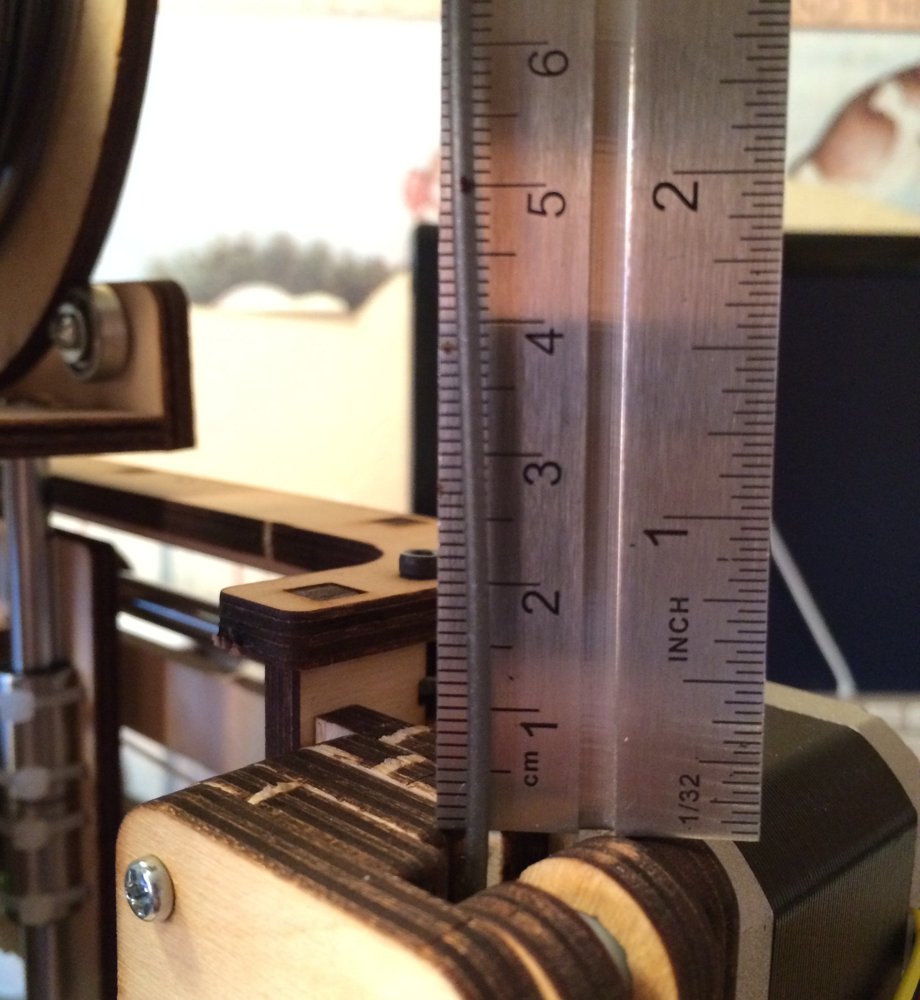

Now that we know how far the printer went when it *thought* it was going 10mm,
we can calculate a new E value so that it will *actually* go 10mm. Go to the
manual control panel and type M501 into the *G-Code* text field and press the
*Send* button. The console will show a bunch of values. The first line or so
should look something like this:

```
< 3:15:46 PM: echo:Stored settings retrieved
< 3:15:46 PM: echo:Steps per unit:
< 3:15:46 PM: echo:  M92 X63.36 Y63.36 Z2272.72 E96.00
< 3:15:46 PM: echo:Maximum feedrates (mm/s):
< 3:15:46 PM: echo:  M203 X100.00 Y100.00 Z2.00 E14.00
< 3:15:46 PM: echo:Maximum Acceleration (mm/s2):
< 3:15:46 PM: echo:  M201 X2000 Y2000 Z30 E10000
< 3:15:46 PM: echo:Acceleration: S=acceleration, T=retract acceleration
< 3:15:46 PM: echo:  M204 S3000.00 T3000.00
< 3:15:46 PM: echo:Advanced variables: S=Min feedrate (mm/s), T=Min travel feedrate (mm/s), B=minimum segment time (ms), X=maximum XY jerk (mm/s),  Z=maximum Z jerk (mm/s),  E=maximum E jerk (mm/s)
< 3:15:46 PM: echo:  M205 S0.00 T0.00 B20000 X20.00 Z0.40 E5.00
< 3:15:46 PM: echo:Home offset (mm):
< 3:15:46 PM: echo:  M206 X0.00 Y0.00 Z0.00
< 3:15:46 PM: echo:PID settings:
< 3:15:46 PM: echo:   M301 P22.20 I1.08 D114.00
< 3:15:46 PM: echo:Min position (mm):
< 3:15:46 PM: echo:  M210 X0.00 Y0.00 Z0.00
< 3:15:46 PM: echo:Max position (mm):
< 3:15:46 PM: echo:  M211 X205.00 Y205.00 Z200.00
```


The last value on that line is the E value, for extruder. Using the incorrect value and how far the printer moved in our
calibration test we can calculate a new value with this equation:

```
(old value * software move)/hardware move = new steps.
```

The *software move* is how far we told the printer to move. The *hardware move* value is
how far it actually moved. 

When I first built my printer the E value was set to 520.  According to the equation:

```
(520 * 10) / 55 =  95
```

So my new value is `95`. Set the new value by typing `M92 E95` into the G-Code
window, but using your E value instead of 95. Now type `M500` and return to save
the new value. Type `M501` to see that the value was saved.

These calibration settings are saved in the printer itself using a special chunk
of memory called the EEPROM. These settings are preserved even if you cut the
power or reflash the printer.

Now try your test again. Measure 50mm, extrude for 10mm, and measure.

**NOTE**

<div class='note'>
The first extrude command you give after setting a new value may give you
spurious results. **Ignore the first command** and measure the second from 50mm.
</div>

Hopefully your printer will move exactly 10mm this time. To be more accurate you
can try testing a movement of 50mm or 100mm instead of 10mm. This will
compensate for small irregularities in your filament.

Almost there! Eventually you will need to repeat the calibration process to find
X, Y, and Z values, as well as level the bed. However these adjustments aren’t
strictly necessary yet. The defaults that came with your printer should be okay
to start. Calibrating X, Y, and Z will greatly improve the quality of your
prints, but aren't needed just to get your first print done (along as they
aren’t too radically off).

## Slic3r setup

To turn a 3D model into instructions that the printer can use we must chop up
the model into a bunch of layers. This process is called slicing. Repetier is
the GUI we are using, but the actual slicing is done by a program embedded
inside it called *Slic3r*. Before we slice the first model we must set up
Slic3r. Click on the Slic3r tab and click the *configure* button.

The first time you open the Slic3r config it will go through a setup wizard.
Follow the prompts. Compare your values to my screenshots below.


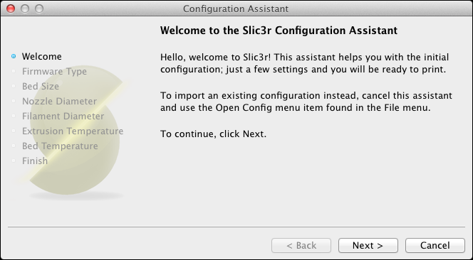
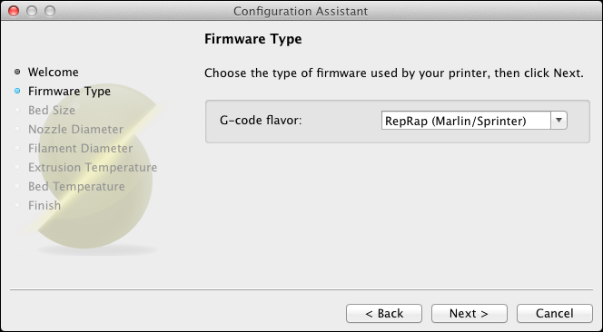
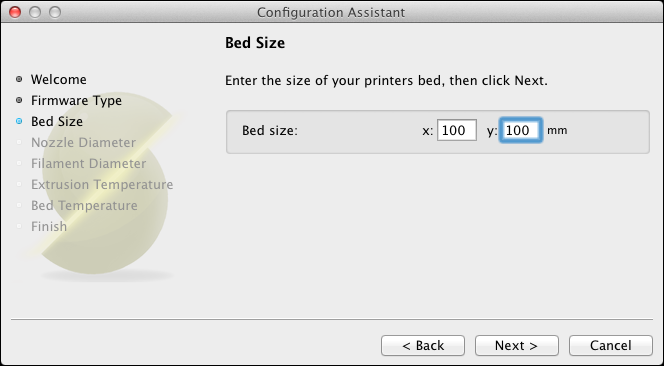
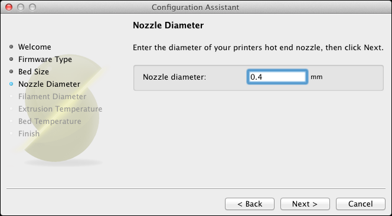
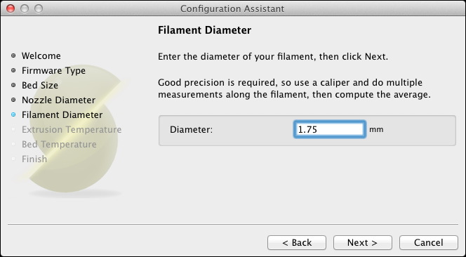

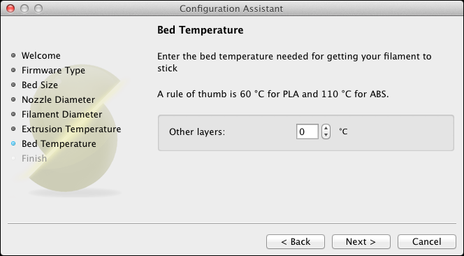
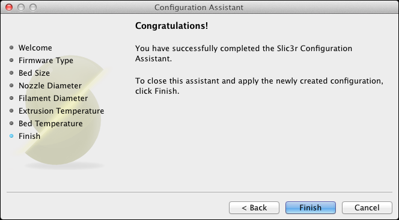


When you are done with the wizard save the new configuration as ‘Simple’.

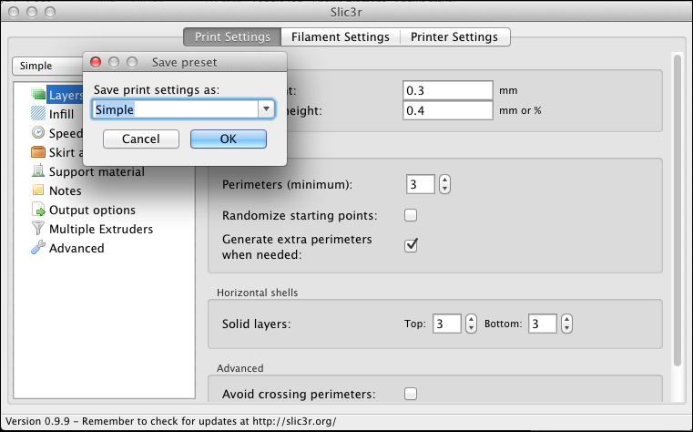

Now switch to the Filament settings tab.  Save it with the name ‘Normal’.

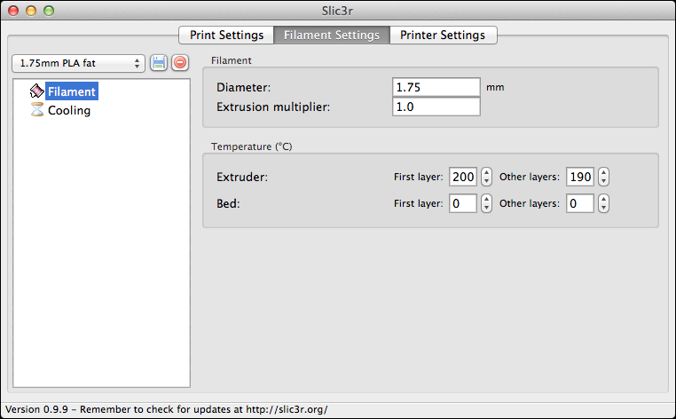

Switch to the Printer Settings tab. Save it with the  name ‘Normal’.

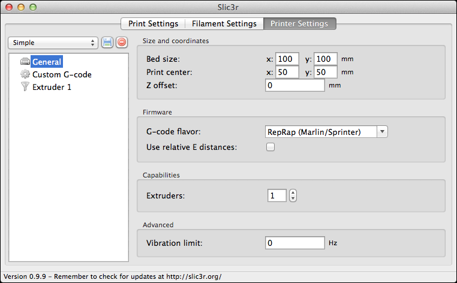

Now close the Slic3r configuration dialog. Back in the main Reptier screen, choose your new profiles for Simple, Normal,
and Normal in Print, Printer, and Filament settings.

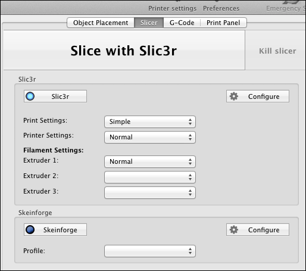

## Your First print

Yes, we can finally print something!

Download [this 3D model][calibration_model] from Thingiverse. It’s a test model
that will reveal problems with the printer settings. On the *Object Placement*
tab click the *Add STL File* button and select the model you just downloaded.

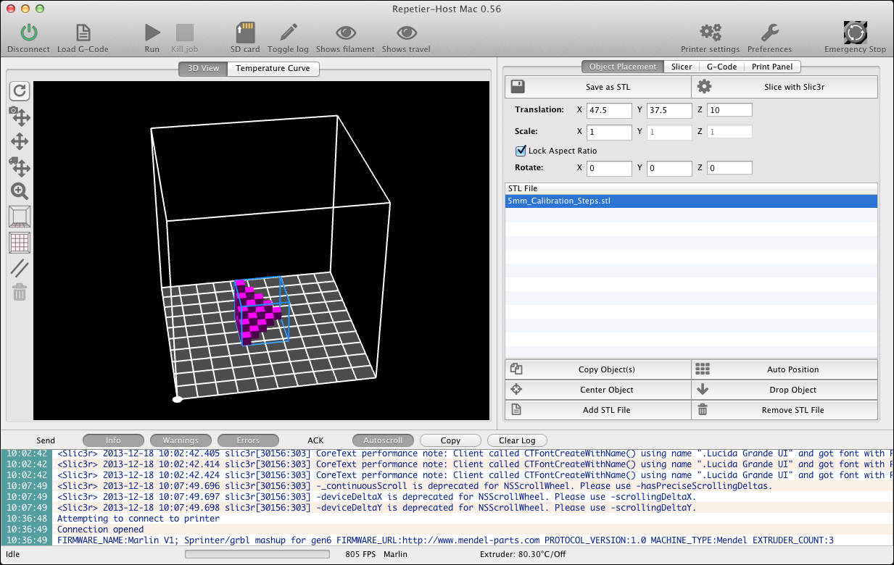

Next switch to the *Slicer* panel, and press the great big *slice* button. You
should see processing messages in the console. When it’s done slicing you can
press the big ‘run’ triangle button. Hopefully you will see the printer kick
into action. It may take a few seconds before actually starting to print because
it must heat up the hot end first.

[calibration_model]: http://www.thingiverse.com/thing:24238

Your first print. Don’t worry if your first print looks horrible. Here are my first five prints:

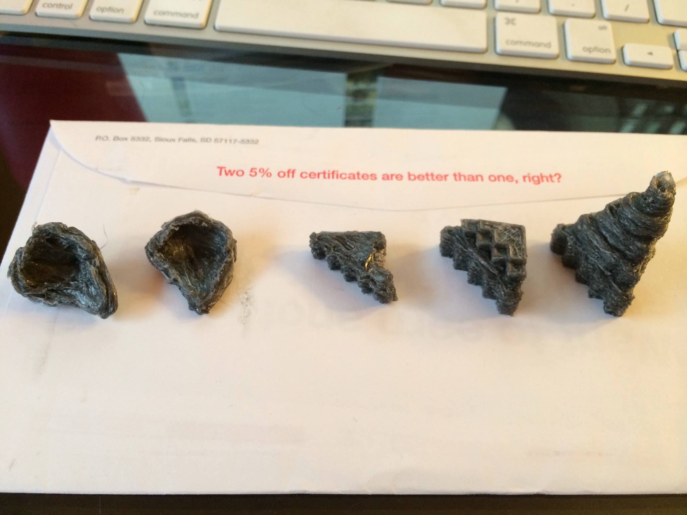

As you can see, they start pretty bad but get better. The first issue you’ll
probably have is getting the print to stick to the bed. If it doesn’t stick then
raise the hot end, scrape off the bad plastic, put some blue painters tape on
the bed, and try again.

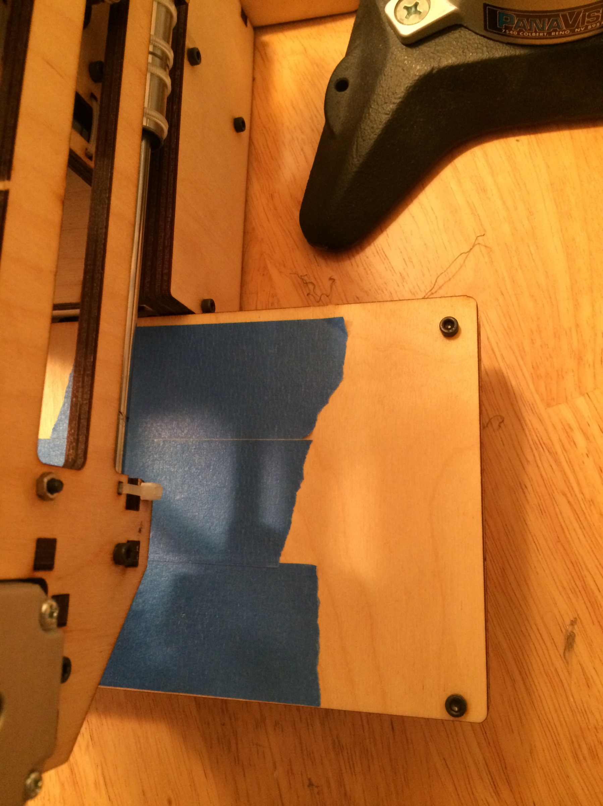

If the print is very gloppy, possibly so much that it sticks to the hot end
instead of the bed, then you are probably *over-extruding*. Adjust the extrusion
factor in the Slic3r settings. If you have to move the extrusion factor way down
solve the problem like I did, then that means your extruder calibration is off.
You need to recalibrate it.

Hopefully you will get a print that at least finishes successfully, even if it
doesn’t look quite right. Congratulations, you made your first print in THREE
DEE!!! You live in the future.

Most likely you’ll have a lot of tuning to do to improve the quality of your
prints. The [forums][printrbottalk] are filled with advice on how to do this. A
few things to check:

[printrbottalk]: http://www.printrbottalk.com/


   * Calibrate your X,Y,Z axes so that moving 50mm really does move 50mm.  
   * Level the bed by lowering the hot end to just above the bed and moving it around. If the bed is level then the distance between the hot end and the bed will be the same at all four corners of the bed. If not you must adjust it with the leveling screws.  
   * Check the tightness of your X and Y strings. Any looseness can cause subtle defects in your prints. The strings will loosen up a lot over your first few prints.
   * Check the actual thickness of your filament using calipers. It can be off from the stated diameter by as much as 10% which will result in over or under extrusion.
   * Vibration and slipping. The printer will vibrate a bit. On a smooth surface this could cause it to move around. Put something soft but level below it, like contact paper or those rubber sheets used for lining tool drawers.


When you are ready to try something more ambitious, there is a world of things
to print on Thingiverse. Here’s a few of my favorites:

   * [Snowflakes](http://www.thingiverse.com/thing:195032)
   * [Batman Symbol](http://www.thingiverse.com/thing:12381)
   * [Small Vase](http://www.thingiverse.com/thing:37327)


<div class='note'>
A note on the vase. The 3D model for the vase is filled. You don’t want that.
Create a new setting for slicer called ‘Vase’ which sets the Horizontal shells
-> Solid layers -> Top to 0, then set the Infill -> Fill density to 0. This will
remove the top and insides of the vase, leaving just the bottom and sides.
</div>


## Troubleshooting

### How to reflash your printer.

I’ve had to reflash my printer a few times. I pulled the plug once and scrambled
the brains of my printrbot. Use the upgrader app but **don’t accept the default
firmware** it downloads. Instead, download the latest firmware from
[here](https://github.com/Printrbot/Marlin/releases/tag/unified-v2) with your
web browser and drag it to the updater icon and follow the instructions on
screen. *This firmware is Printrbot's own slightly modified firmware for the Simple*. 
Using the default was the source of a lot of my frustration early on because
the printer would appear work but the extruder stepper would go backwards and 
I had many communications errors. With the correct firmware it all works
perfectly.

### Fixing extruder problems

Hopefully you left some slack on the cable like I mentioned above. If so then,
after turning off the heat and letting it cool down, you can just take out the
four screws holding the stepper in and slide it out the back. Make sure the gear
is securely attached to the stepper shaft. Also make sure it is the right
distance from the stepper. When you look at your printer from above the gear and
roller should be centered with the opening and tube. [picture of mine]

### Cleaning your extruder and hot end

If your extrusion stepper makes a loud click and the filament stops advancing
then you may have a clog. Try turning the temp up to 220C, open up the filament
clamp and push some extrusion through manually. If it still doesn’t come out
then you definitely have a clog. You’ll have to clean it.

Cool down the hot end to room temp then unplug the printer. Unplug the hot end
and remove it from the extruder head. Put the Slide off the heat shield then use
a pliers and a wrench try unscrew the brass nozzle. Keep the wrench on the hex
nut area half way up, and keep it still. Turn using the pliers on the nozzle.
After you get it off lightly scrap off any plastic on the outside of the nozzle.

Now we turn to the tube of the hot end. If you look closely you’ll probably see
a buildup of dark, possibly black, plastic clogging the tube. Clamp the tube to
a vise and plug it back in, without the nozzle attached, to the power and
thermistor. Turn the printer back on and crank up the heat. Hopefully the clog
will just melt out. Then cool everything back down, reassemble, and you are back
in business. Watch [this video][clean_extruder] by Youtube user *curlnizzle* for
a visual demonstration.

[clean_extruder]: http://www.youtube.com/watch?v=GYieRYamhNA

### Diagnosing print quality issues

Pretty much every print quality issue comes down to calibration. Whenever you
are experiencing print issues the first thing you should do is recalibrate the
X, Y, Z axis and Extruder value. Also check that the strings for the X and Y
axis are tight. And finally, check that the Z axis is just barely above the
print bed when homed. 

You can often tell what needs to be recalibrated by the particular defects in
your prints. Let me show you photos of the calibration I recently did on my
Simple.


I started with [this calibration object][calibration_model]. It should be
exactly 25mm along each dimension.

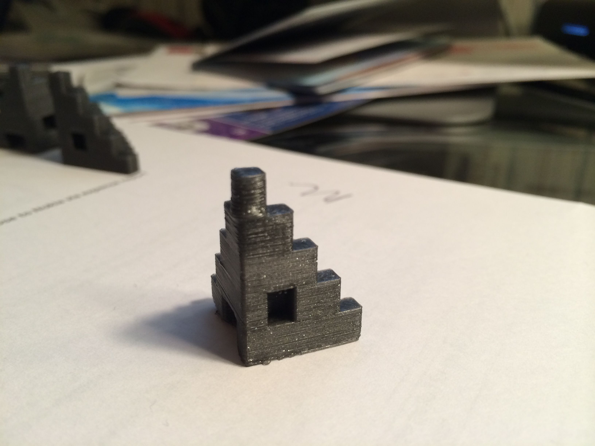

Notice that while the corners are pretty sharp the square hole in the side isn't
actually square. It is supposed to be 5mm by 5mm, but clearly isn't. This meant
I needed to recalibrate my X, Y, and Z axis. You might thing I only need to
adjust the Z axis, but the Z was actually pretty good. The X and Y were too
narrow.


To calibrate I measured the length of the X and Y sides, discovering they were
about 15% off. After calibration I reprinted the object.

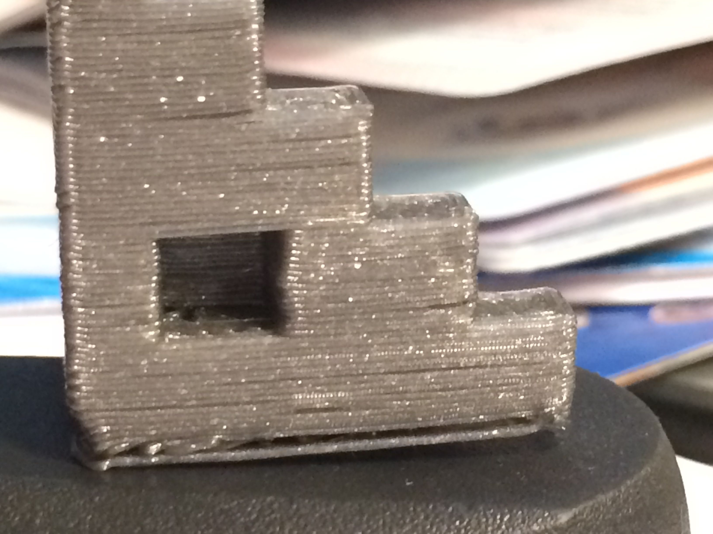

Now we can see that the bottom has defects. It feels loose, as if there wasn't
enough material at the bottom. Also notice defects along some of the horizontal
lines higher up.

The problem now is that I'm not extruding enough material. I had set my
extrusion factor to 0.6. I now see that I had previously pulled the extrusion
factor down because the x and y were squished, resulting in thicker layers. With
the X and Y fixed I'm now not getting enough. The fix was to set the extrusion
factor back to 1.0.


Next print:

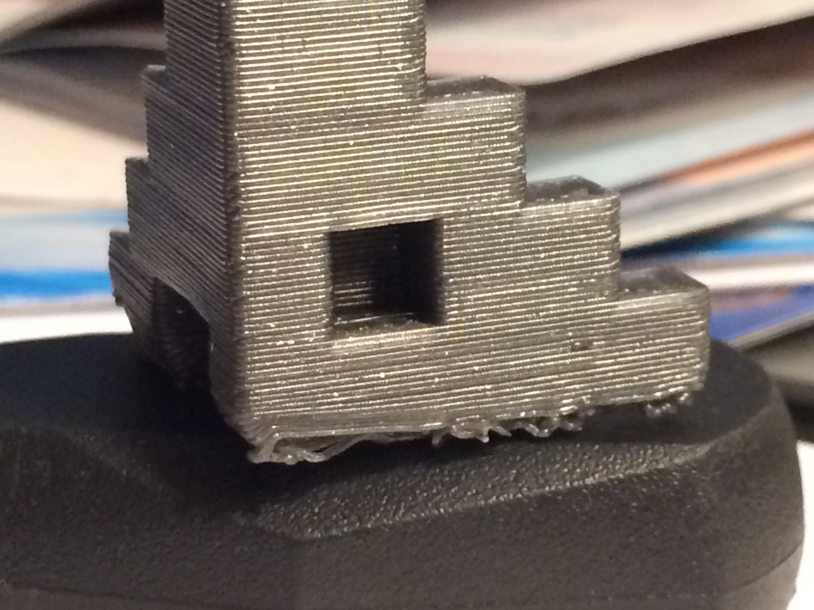

Much better. The bottom is still loose, but the layers are uniform. No
defects. Here's a shot of before and after.

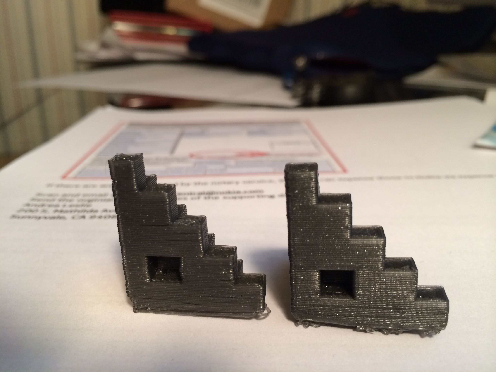

Now that I'm extruding the right amount material, let's figure out what's going
on at the bottom.

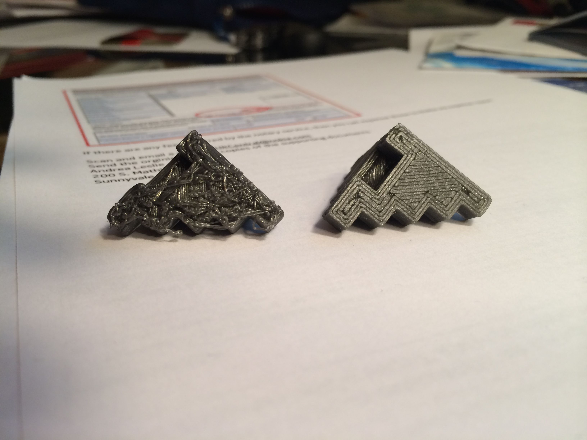

On the left is the current print.  On the right is what we want. It looks like
the filament went all over the place until it stacked up enough to provide a base
for the upper layers.  Since our extrusion factor is okay there's only one more
place to look. Bed height.

I homed the Z axis then checked the distance between the hot end and the bed.
Sure enough, waaay too much space. About two millimeters. The distance should
be almost 0, just enough to slip a few sheets of paper in. 

To fix the Z axis I adjusted the Z end stop screw, pulled the Z axis up a few
centimeters manually (with the Print Panel in Repetier), then pressed the Home
button. The printer recalibrated the Z and I measured again.  Still a bit high,
so i adjusted the screw again and re-homed. 

One more print. Perfect!

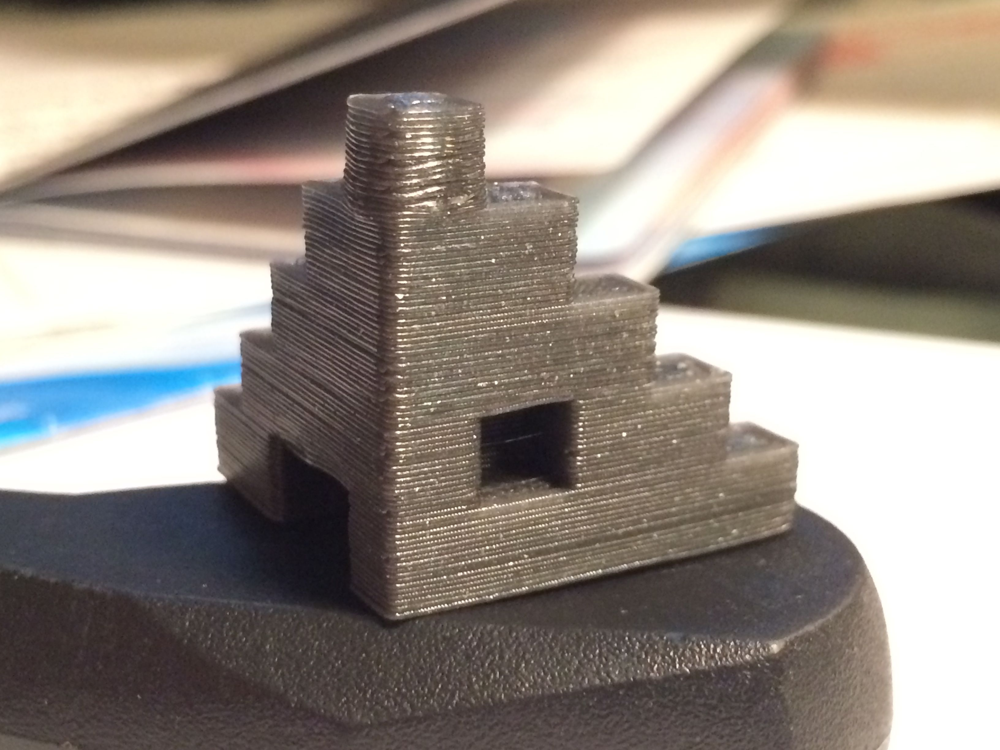

Actually, it's not quite perfect. I think the X axis is still slightly off and
you can see the top layer looks slightly different than the others. Still, it's
more than good enough to start building usable models like snowflakes and phone
docks for Christmas.

Have fun!


## Upgrades

You might want to print a few upgrades.

If you have the Simple with the Tower upgrade, then you might want [this guide
for the Z axis](http://www.thingiverse.com/thing:203071)

Bed leveling screw grips
http://www.thingiverse.com/thing:103519

A filament guide

http://www.thingiverse.com/thing:128240


